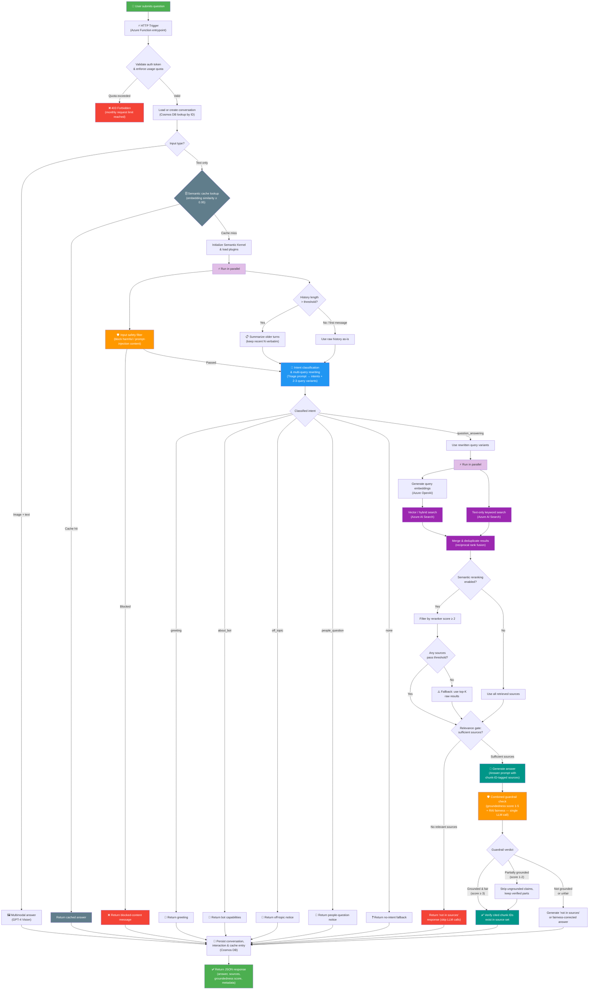

# RAG Orchestrator – Optimized Prompt Processing Flow

```mermaid
flowchart TD
    A["👤 User submits question"] --> B["⚡ HTTP Trigger\n(Azure Function entrypoint)"]
    B --> C{"Validate auth token\n& enforce usage quota"}
    C -- "Quota exceeded" --> C1["❌ 403 Forbidden\n(monthly request limit reached)"]
    C -- "Valid" --> D["Load or create conversation\n(Cosmos DB lookup by ID)"]
    D --> E{"Input type?"}
    E -- "Image + text" --> F["🖼️ Multimodal answer\n(GPT-4 Vision)"]
    F --> SAVE

    E -- "Text only" --> CACHE{"🗄️ Semantic cache lookup\n(embedding similarity ≥ 0.95)"}
    CACHE -- "Cache hit" --> CACHE_RET["Return cached answer"]
    CACHE_RET --> SAVE

    CACHE -- "Cache miss" --> G["Initialize Semantic Kernel\n& load plugins"]

    G --> PAR1["⚡ Run in parallel"]

    PAR1 --> H["🛡️ Input safety filter\n(block harmful / prompt-injection content)"]
    PAR1 --> I{"History length\n> threshold?"}

    I -- "Yes" --> I1["📋 Summarize older turns\n(keep recent N verbatim)"]
    I -- "No / first message" --> I2["Use raw history as-is"]
    I1 --> J
    I2 --> J

    H -- "Blocked" --> H1["❌ Return blocked-content message"]
    H1 --> SAVE
    H -- "Passed" --> J

    J["🔀 Intent classification\n& multi-query rewriting\n(Triage prompt → intents + 2-3 query variants)"]

    J --> K{"Classified intent"}

    K -- "greeting" --> K1["💬 Return greeting"]
    K -- "about_bot" --> K2["🤖 Return bot capabilities"]
    K -- "off_topic" --> K3["🚫 Return off-topic notice"]
    K -- "people_question" --> K4["👤 Return people-question notice"]
    K -- "none" --> K5["❓ Return no-intent fallback"]

    K -- "question_answering" --> L["Use rewritten query variants"]

    L --> PAR2["⚡ Run in parallel"]
    PAR2 --> EMB["Generate query embeddings\n(Azure OpenAI)"]
    PAR2 --> TXT["Text-only keyword search\n(Azure AI Search)"]

    EMB --> VEC["Vector / hybrid search\n(Azure AI Search)"]
    VEC --> MERGE["Merge & deduplicate results\n(reciprocal rank fusion)"]
    TXT --> MERGE

    MERGE --> N{"Semantic reranking\nenabled?"}
    N -- "Yes" --> N1["Filter by reranker score ≥ 2"]
    N1 --> N3{"Any sources\npass threshold?"}
    N3 -- "Yes" --> REL
    N3 -- "No" --> N4["⚠️ Fallback: use top-K\nraw results"]
    N4 --> REL
    N -- "No" --> N2["Use all retrieved sources"]
    N2 --> REL

    REL{"Relevance gate:\nsufficient sources?"}
    REL -- "No relevant sources" --> REL1["Return 'not in sources'\nresponse (skip LLM calls)"]
    REL1 --> SAVE

    REL -- "Sufficient sources" --> O["📝 Generate answer\n(Answer prompt with\nchunk-ID-tagged sources)"]

    O --> PQ["🛡️ Combined guardrail check\n(groundedness score 1-5\n+ RAI fairness — single LLM call)"]

    PQ --> PQ_RESULT{"Guardrail verdict"}
    PQ_RESULT -- "Grounded & fair\n(score ≥ 3)" --> CIT["✅ Verify cited chunk IDs\nexist in source set"]
    PQ_RESULT -- "Partially grounded\n(score 1-2)" --> PQ_PART["Strip ungrounded claims,\nkeep verified parts"]
    PQ_PART --> CIT
    PQ_RESULT -- "Not grounded\nor unfair" --> Q1["Generate 'not in sources'\nor fairness-corrected answer"]
    Q1 --> SAVE

    CIT --> SAVE

    K1 --> SAVE
    K2 --> SAVE
    K3 --> SAVE
    K4 --> SAVE
    K5 --> SAVE

    SAVE["💾 Persist conversation,\ninteraction & cache entry\n(Cosmos DB)"]
    SAVE --> RET["✅ Return JSON response\n(answer, sources,\ngroundedness score, metadata)"]

    style A fill:#4CAF50,color:#fff
    style H fill:#FF9800,color:#fff
    style PQ fill:#FF9800,color:#fff
    style J fill:#2196F3,color:#fff
    style MERGE fill:#9C27B0,color:#fff
    style VEC fill:#9C27B0,color:#fff
    style TXT fill:#9C27B0,color:#fff
    style O fill:#009688,color:#fff
    style C1 fill:#f44336,color:#fff
    style H1 fill:#f44336,color:#fff
    style REL1 fill:#f44336,color:#fff
    style RET fill:#4CAF50,color:#fff
    style CACHE fill:#607D8B,color:#fff
    style CACHE_RET fill:#607D8B,color:#fff
    style PAR1 fill:#E1BEE7,color:#333
    style PAR2 fill:#E1BEE7,color:#333
    style CIT fill:#009688,color:#fff
```
